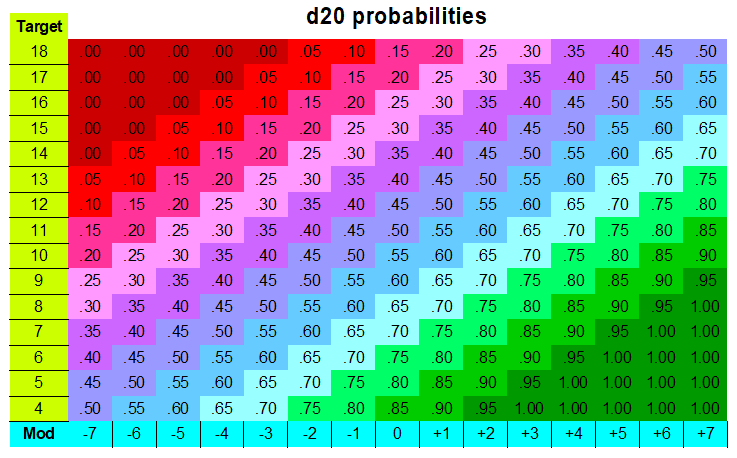
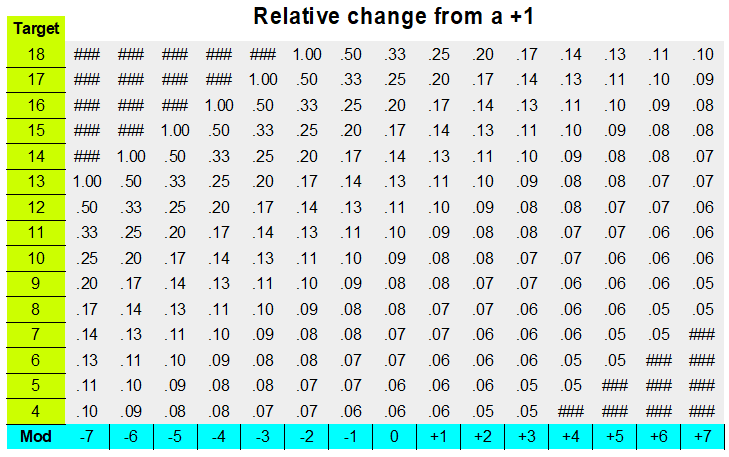

```{r setup, include=FALSE}
knitr::opts_chunk$set(echo = TRUE)
library(tidyverse)
```

## Introduction

I'm starting this document to have a look at the probabilities in the basic "success or failure decided by rolling a twenty sided die"-system. There will be an introduction to the dice rolls involved, but it will concentrate on the purely mechanical parts and likely won't make the overall text all that more interesting to someone who hasn't played role playing games with this mechanic.


## The system

In this system, much used by various RPG, most famously Dungeons and Dragons, you roll a twenty sided die (a d20), potentially add a modifier such as +1 or -2 to the outcome and compare the resulting mumber to a target number. If the result matches or exceeds the result, the attack or attempt at action succeeds. Additionally, for combat, a roll of 20 is always a success and a 1 always a failure, regardless of modifiers and target numbers, but this does not apply outside of combat.

The probabilities in this system are fairly simple, even if they, for a non-mathematician or a mathematician who doesn't stop to think about it, aren't immediately obvious. What isn't obvious to me though, even though I have at least a little mathematicall skill, is how much the modifiers change the relative probabilities, and that is what I ultimately wish to explore.

## The Basic probabilites

Imagine you roll against a target (T) of 11. Ten possible outcomes (R) (1-10) will signify failure, ten outcomes (11-20) will signify success. So the probability of success is 50%. Changing the target or using a modifier (M) will increase or decrease the probability of success by 5 percentage points per step (the steps are always integers) away from baseline, so we could set up a formula for the probability of success that looks like this:

$$ P(S) = 0.5 + .05*(11-T) + .05*M $$

If the roll represents an attack and $P(S)$ is outside the range 0-1, the probability defaults to either 5% for values below or 95% for values above. By manipulating this formula, or thinking about the challenge in a slightly different way, we can "simplify" it thus:

$$ P(S) = 1.05 - .05*(T-M) $$

If $T-M$ is 1 or less success is guaranteed (except in combat) and if it is 21 or more failure is guaranteed.

And while we're doing unnecessarily complicated descriptions, why not set this up as a table:



Okay, that's not a super helpful visualizing and it was a drag to make, so that's why not. But at least it was good practice.

## The Benefits of Upgrades

So the basic probabilities are fairly straight forward. But what about the benefits of upgrades. Getting a +1 modifier from leveling up or getting a magic item will shift the probability 5 percentage points, but how much does that change things, relatively speaking.

That of course depends on your existing modifiers and the target. And ... I guess nothing else. This might turn out much less interesting than I was thinking initially. On the other hand I get to reuse my terrible table. The relative increase in probability will be the increase divided by the current value. So, making a quick derived table, we get:



That's not super interesting at first glance. It was of course obvious that the biggest relative increase would be for the situations with the lowest probability, and since it's an inverse relationship it should have been obvious that it would change little for the higher probabilities and more dramatically for the lower. But it does suggest a more useful visualization.

```{r fig. 1 - challenge vs. relative effect of +1, echo = FALSE}

challenge <- seq.int(1,18)


df <- tibble(challenge = challenge,
             rel_prob_increase = 1/(21 - challenge))

df %>% ggplot() +
  geom_point(aes(challenge, rel_prob_increase)) +
  xlab("Challenge (Target minus Modifiers)") +
  ylab("Relative increase (%) in probability of success") +
  ggtitle("Effect of a +1 gain in modifier")
```

If you have a +3 to hit and you're up against a target of 13, getting that additional +1 is an additional 10%. If you have to hit a target of 20, it's an additional 25%, but that only shifts you from a probability of .20 to .25, so you're still going to roll a lot of misses.

## Conclusion

In the end this was probably mostly helpful to me as a GM to see a good way to think about the difficult of challenges I put in front of the players. And it's not even all that useful in that sense, since that calculation also has to include how much damage the actor (player or monster) deals, and how much damage the recipient can take. And there is also damage vulnerabilities and advantage and disadvantage on rolls, but that's a topic for my next next-to-useless post about DnD probability!